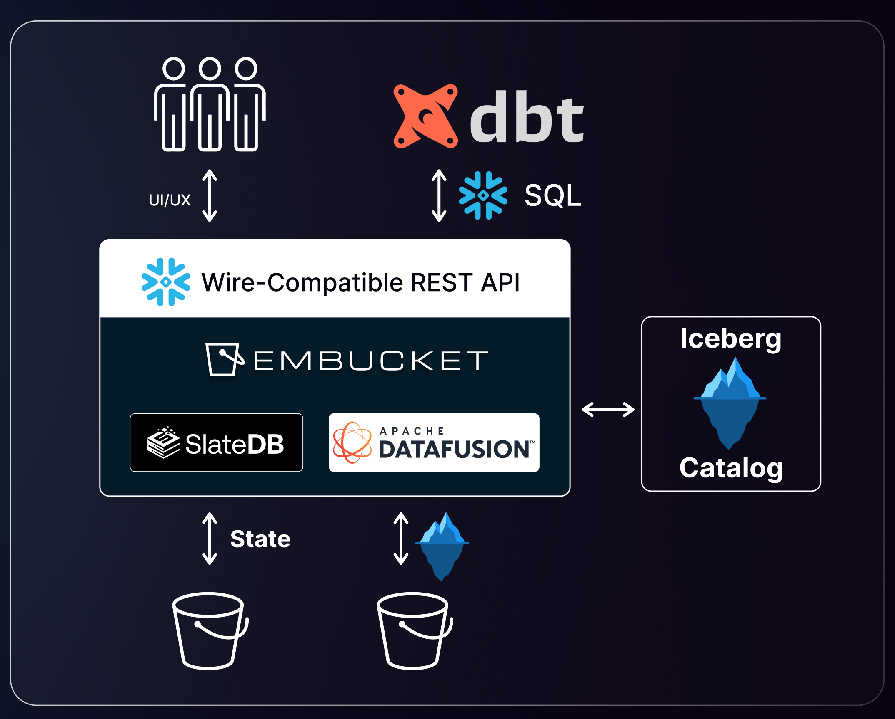

# Embucket: Snowflake compatible lakehouse platform  

[](https://opensource.org/licenses/Apache-2.0)
[](test/README.md)

Embucket is an Apache‑2.0‑licensed, Snowflake‑compatible lakehouse platform built for radical simplicity and full openness. It delivers:  
- A **Snowflake‑style** REST API and SQL dialect  
- **Apache Iceberg** table format under the hood  
- **Iceberg REST API** for both internal and external engines  
- **Zero‑disk**, object‑store‑only architecture (S3 or memory)  
- **Statically linked single‑binary** for effortless deployment  
- **SlateDB** for metadata persistence  
- **Apache DataFusion** as the query engine  

## Features  

- **Snowflake compatible API**  
  - Snowflake SQL syntax dialect
  - Snowflake v1 wire compatible REST API

- **Apache Iceberg**  
  - Data stored in Iceberg format on object storage  
  - Built-in internal catalog
  - Exposes Iceberg REST Catalog API

- **Zero disk architecture**  
  - All state (data + metadata) lives in your s3 buckets
  - No other dependencies required

- **Scalable "query-per-node" parallelism**  
  - Spin up multiple Embucket instances against the same bucket
  - Each node handles queries independently for horizontal scale  

- **Single statically linked binary**  
  - One `embucket` executable with zero external dependencies  

- **Iceberg catalog federation**  
  - Connect to external Iceberg REST catalogs  
  - Read/write across catalogs

## Architecture



Embucket is designed with radical simplicity in mind: it is a single binary that runs as a server and provides a REST API for interacting with the lakehouse. It has single dependency - object storage - for both data and metadata.

It is built on top of several open source projects:

- [Apache DataFusion](https://github.com/apache/datafusion) - query engine
- [Apache Iceberg](https://github.com/apache/iceberg) - data storage
- [SlateDB](https://github.com/slatedb/slatedb) - metadata persistence

Embucket has deep integration with AWS S3 table buckets and relies on them for proper table maintenance.

## SLT coverage

*This visualization is automatically updated by CI/CD when tests are run.*

### Install Embucket  

```sh
# Clone and build the Embucket binary
git clone git@github.com:Embucket/embucket.git
cd embucket/
cargo build
```

### Configure and run Embucket  

You can configure Embucket via CLI arguments or environment variables:

```sh
# Create a .env configuration file
cat << EOF > .env
# SlateDB storage settings
OBJECT_STORE_BACKEND=memory
FILE_STORAGE_PATH=data
SLATEDB_PREFIX=sdb

# Optional: AWS S3 storage (leave blank if using local storage)
AWS_ACCESS_KEY_ID="<your_aws_access_key_id>"
AWS_SECRET_ACCESS_KEY="<your_aws_secret_access_key>"
AWS_REGION="<your_aws_region>"
S3_BUCKET="<your_s3_bucket>"
S3_ALLOW_HTTP=

# Iceberg Catalog settings
# Set to your catalog url
CATALOG_URL=http://127.0.0.1:3000

# Optional: CORS settings
CORS_ENABLED=true
CORS_ALLOW_ORIGIN=http://localhost:8080

EOF

# Load environment variables (optional)
export $(grep -v '^#' .env | xargs)

# Start Embucket
./target/debug/bucketd
```

Once embucket is running, open:  

- [localhost:8080](http://localhost:8080) → UI Dashboard  
- [localhost:3000/catalog](http://localhost:3000/catalog) → Iceberg REST Catalog API  


## Demo: running dbt project with Embucket  

This demo showcases how to use Embucket with `dbt` and execute the `snowplow_web` dbt project, treating Embucket as a Snowflake-compatible database.

### Prerequisites

* python 3.9+ installed
* virtualenv installed

### Run dbt workflow  

```sh
# Clone the dbt project with Snowplow package installed
git clone git@github.com:Embucket/compatibility-test-suite.git
cd compatibility-test-suite/dbt-snowplow/

# Set up a virtual environment and install dependencies
virtualenv .venv
source .venv/bin/activate
pip install dbt-core dbt-snowflake

# Activate virtual environment
source .venv/bin/activate

# Set Snowflake-like environment variables
export SNOWFLAKE_USER=user
export SNOWFLAKE_PASSWORD=xxx
export SNOWFLAKE_DB=snowplow
export SNOWFLAKE_SCHEMA=public
export SNOWFLAKE_WAREHOUSE=snowplow

# Install the dbt Snowplow package
dbt deps

# Upload source data
python3 upload.py

# Upload initial data
dbt seed

# Run dbt transformations
dbt run -m snowplow_web
```

## Contributing  

We welcome contributions! To get involved:  

1. **Fork** the repository on GitHub  
2. **Create** a new branch for your feature or bug fix  
3. **Submit** a pull request with a detailed description  

For more details, see [CONTRIBUTING.md](CONTRIBUTING.md).  

## License  

This project is licensed under the **Apache 2.0 License**. See [LICENSE](LICENSE) for details.  

