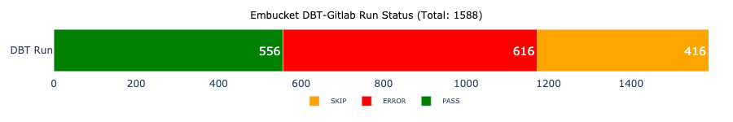

# How to run dbt-gitlab project?

1. cd into dbt-gitlab directory
```sh
cd dbt-gitlab
```

2. Rename `.env_example`  to `.env` file and add Snowflake credentials. Embucket does not require any changes as of now.

3. Make file executable
```sh
chmod +x run.sh
```

4. Run dbt-gitlab project
```sh
./run.sh --target embucket
```

```sh
./run.sh --target snowflake
```

Optionally, a specific model pipeline can be triggered using the following command:
```sh
./run.sh --target database --model model_name
```


Files to start with:

**top_errors.txt** - file with the top 10 errors

**run.log** - file with the logs after the last run


Emucket dbt run result:
